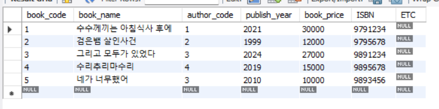
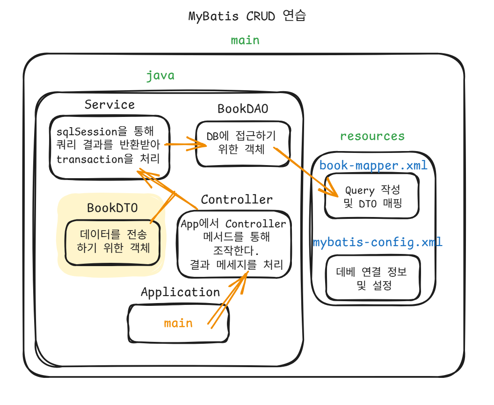

# My-Batis CRUD Practice
작성자 : 김예람

## STEPS
### 1. config.xml 파일 작성
MyBatis 설정 파일로, 데이터베이스 연결 정보와 매퍼 파일 경로를 설정한다.
```xml
<?xml version="1.0" encoding="UTF-8" ?>
<!DOCTYPE configuration
        PUBLIC "-//mybatis.org//DTD Config 3.0//EN"
        "https://mybatis.org/dtd/mybatis-3-config.dtd">
<configuration>
    <environments default="development">
        <environment id="development">
            <transactionManager type="JDBC"/>
            <dataSource type="POOLED">
                <property name="driver" value="com.mysql.cj.jdbc.Driver"/>
                <property name="url" value="jdbc:mysql://localhost:3306/your_db"/>
                <property name="username" value="your_username"/>
                <property name="password" value="your_password"/>
            </dataSource>
        </environment>
    </environments>
    <mappers>
        <mapper resource="mappers/BookMapper.xml"/>
    </mappers>
</configuration>
```

### 2. mapper.xml 파일 작성
SQL 쿼리와 결과 매핑을 정의
```xml
<?xml version="1.0" encoding="UTF-8" ?>
<!DOCTYPE mapper
        PUBLIC "-//mybatis.org//DTD Mapper 3.0//EN"
        "https://mybatis.org/dtd/mybatis-3-mapper.dtd">
<mapper namespace="bookMapper">
    <!-- 조회한 컬럼, DTO를 매핑 시키기 위한 설정 작성 -->
    <select id = "selectAllBook" resultMap = "bookResultMap">
        SELECT
        BOOK_CODE
        , BOOK_NAME
        , AUTHOR_CODE
        , PUBLISH_YEAR
        , BOOK_PRICE
        , ISBN
        , ETC
        FROM PRODUCT_LIST
        ORDER BT BOOK_CODE
    </select>
</mapper>
```


### 3. DTO 작성
조회한 컬럼과 DTO를 매핑시켜 사용하기 위해 BookDTO를 작성한다.
```java
public class BookDTO {
    private int bookCode;
    private String bookName;
    private int authorCode;
    private int publishYear;
    private int bookPrice;
    private String isbn;
    private String etc;

    // 기본 생성자
    public BookDTO() {}

    // getter/setter 메서드들
    public int getBookCode() { return bookCode; }
    public void setBookCode(int bookCode) { this.bookCode = bookCode; }
    
    public String getBookName() { return bookName; }
    public void setBookName(String bookName) { this.bookName = bookName; }
    
    public int getAuthorCode() { return authorCode; }
    public void setAuthorCode(int authorCode) { this.authorCode = authorCode; }
    
    // ... 나머지 getter/setter
}
```
<br>

`mysql db`



### 4. template(SqlSession 관리)
SqlSessionFactory를 이용해 싱글톤 패턴으로 SqlSession을 관리하는 Template 클래스를 작성

### 5. DAO 작성
SqlSession을 이용해 데이터베이스 작업을 수행하는 DAO 클래스를 작성
```java
public class BookDAO {

    public List<BookDTO> selectAllBook(SqlSession sqlSession){
        return sqlSession.selectList("BookMapper.selectAllBook");
    }
}
```

### 6.  Service 클래스 - 비즈니스 로직 처리
DAO를 통한 조회 결과를 받고 트랜잭션을 관리
`BookService.java`
```java
public List<BookDTO> selectallBook(){

        SqlSession sqlSession = getSqlSession();

        List<BookDTO> bookList = bookDAO.selectAllBook(sqlSession);

        sqlSession.close();

        return bookList;
    }
 ```

### 7.  Controller 클래스 - 사용자 요청 처리
Application에서 사용자 입력을 받아 적절한 서비스 메서드를 호출
`Application.java`
```java
package com.ohgiraffers.xmlconfig;

import java.util.Scanner;

public class Application {
    public static void main(String[] args) {

        Scanner sc = new Scanner(System.in);

        BookController bookController = new BookController();

        boolean trigger = true;
        do{
            int select = sc.nextInt();

            switch (select){
                case 1:
                    bookController.selectAllBook();
                    break;
                case - 1:
                    trigger = false;
                    break;
            }
        }while (trigger);

    }


}
```

`BookController.java`
```java
public void selectAllBook(){

        List<BookDTO> menuList = bookService.selectAllBook();

        if(menuList != null){
            printResult.printBookList(menuList);
        }else {
            printResult.printErrorMessage("selectList");
        }
    }
```

데이터 객체를 전달해야 하는 경우, `DTO` 를 이용해 전달한다.
`BookController.java`
```java
 public void registBook(Map<String, String> parameter) {

        String name = parameter.get("name");
        int price = Integer.parseInt(parameter.get("price"));
        int year = Integer.parseInt(parameter.get("pubYear"));
        int isbn = Integer.parseInt(parameter.get("isbn"));
        int authorCode = Integer.parseInt(parameter.get("authorCode"));

        BookDTO book = new BookDTO();
        book.setBookName(name);
        book.setAuthorName(authorCode);
        book.setBookPrice(price);
        book.setPublishYear(year);
        book.setIsbn(isbn);

        if(bookService.registBook(book)){
            printResult.printSuccessMessage("insert");
        }else{
            printResult.printErrorMessage("insert");
        }
    }
```
BookDTO 객체로 속성들을 합쳐서 Service의 메서드를 이용해 db에 전송?한다.
```java
public boolean registBook(BookDTO book) {

        SqlSession sqlSession = getSqlSession();

        int result = bookDAO.insertMenu(sqlSession, book);

        if(result > 0){
            sqlSession.commit();
        }else{
            sqlSession.rollback();
        }

        sqlSession.close();

        return result > 0 ? true : false;
    }
```
이 코드에서 DAO를 통해 전달된 명령이 제대로 수행되지 못했다면, rollback을 함으로써
데이터의 무결성 원칙을 지킨다.

## Architecture Flow
Application → Controller → Service → DAO → MyBatis Mapper → Database

### 💡각 계층의 역할
**Controller**: 사용자 입력/출력 처리
<br>
**Service**: 비즈니스 로직 및 트랜잭션 관리<br>
**DAO**: 데이터 접근 로직<br>
**Mapper**: SQL 쿼리 정의

